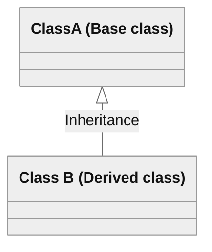
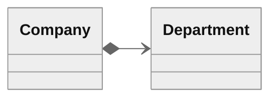
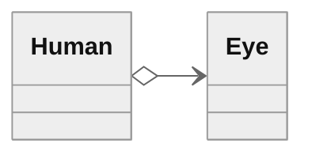
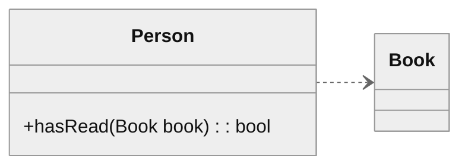

## Software Design

It's the art of managing interdependencies between software components. It aims at minimizing artificial (technical) dependencies and introduces the necessary abstractions and compromises.[^footnote]

## Abstraction

The term `abstraction` is used to describe the modeling of common behavior and the **representation of a set of requirements and expectations**[^footnote].    

## Software Development Levels[^footnote]

- **Design Level**
  - Software Architecture `(Architecture Patterns: client-server, microservices, etc.)`: Represents the overall strategy of your software approach.
  - Software Design `(Design Patterns: Visitor, decorator, Strategy, etc.)`: Represents the tactics to make the (software architecture) strategy work. 
- **Idioms** `(Implementation Patterns: NVI, Pimpl, RAII, etc.)`: Represents an implementation pattern. Also known as a language-specific solution for a recurring problem.
- **Code Level**
  - Implementation Details `(Implementation Patterns: st::make_unique, std::enable_if, etc.)`

## Low Coupling and High Cohesion[^fn-nth-5]

### What is coupling?
**Coupling refers to the degree of dependency or interaction between different components of a system**, such as classes, methods, or modules. High coupling means that a change in one component affects many others, making the system complex, rigid, and fragile. Low coupling means that the components are loosely connected and can function independently, making the system simple, flexible, and robust.

### What is cohesion?
**Cohesion refers to the degree of relatedness or consistency of the responsibilities or functionalities of a single component of a system**, such as a class, method, or module. High cohesion means that the component does only one thing well and has a clear purpose and scope. Low cohesion means that the component does many things poorly and has a vague or overlapping role and scope.

 
> Low coupling and high cohesion are desirable qualities for code as they can improve its readability, maintainability, and testability. By following these principles, you can gain modularity, encapsulation, abstraction, polymorphism, and inheritance.
{: .prompt-tip }

## Modularity
Modularity allows you to divide your system into smaller, independent units that can be reused and composed in different ways. 

## Encapsulation
Encapsulation hides implementation details and internal state from other components. 

## Polymorphism 
Polymorphism defines different types of components that share a common interface and behavior but have different implementations.

## Unified Modeling Language (UML)
It's a general-purpose visual modeling language that is intended to provide a standard way to visualize the design of a system[^fn-nth-2]. A relationship is a general term covering the specific types of logical connections found on class and object diagrams[^fn-nth-3], [^fn-nth-4].

### Inheritance
Refers to the ability of one class (Derived class) to inherit the identical functionality of another class (Base class), and then add new functionality of its own.

### Composition

One object A has or owns another object B, and/or B is part of A. B cannot live without A. In the relationship modeled below, a Company class instance will always have at least one Department class instance. Because the relationship is a composition relationship, when the Company instance is removed/destroyed, the Department instance is automatically removed/destroyed as well.

### Aggregation

Indicates that one class is a part of another class. The child class instance can outlive its parent class. 

### Dependency

An object of one class might use an object of another class in the code. If the object is not stored in any field, then this is modeled as a dependency relationship.

 
 
 
## Footnotes

[^footnote]: Klaus Iglberger, *C++ Software Design*, 1st ed. (O'Reilly, 2022)  
[^fn-nth-2]: [Unified Modeling Language](https://en.wikipedia.org/wiki/Unified_Modeling_Language){:target="_blank"}
[^fn-nth-3]: [The UML 2 class diagram](https://developer.ibm.com/articles/the-class-diagram/){:target="_blank"}
[^fn-nth-4]: [UML](http://www.cs.utsa.edu/~cs3443/uml/uml.html){:target="_blank"}
[^fn-nth-5]: [How do you design and test your objects for low coupling and high cohesion?](https://www.linkedin.com/advice/0/how-do-you-design-test-your-objects-low-coupling){:target="_blank"}

